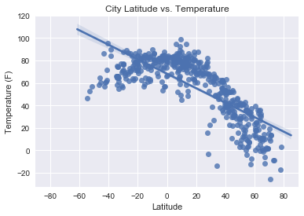
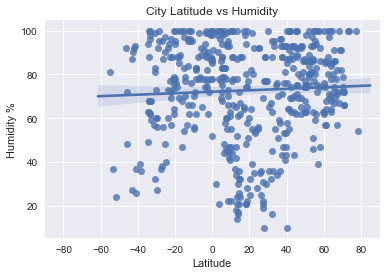
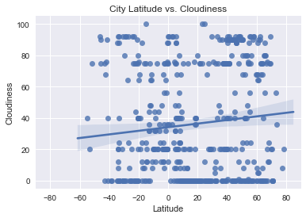
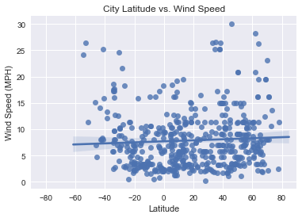

```python
# Observable Trend 1:
# In the Temperature (F) vs. Latitude Graph, it is clear that temperature decreases when latitude increases. 
# Why might this be? It is due to the fact that higher latitudes are currently experiencing a colder season than
# lower latitudes. Meaning, it's winter in latitudes above the equator and summer below the equator.  

# Observable Trend 2:
# There are many more observable cities in the 60 to 80 range than the -80 to -60 range, which might reflect 
# higher population and land area in the northen hemisphere than the southern hemisphere. 

# Observable Trend 3:
# There seems to be no significant relationship between wind speed and latitude, as the regression line is flat and
# there is no obvious pattern in the data.
```


```python
import sys
#reload(sys)
#sys.setdefaultencoding("utf-8")
```


```python
# Dependencies
import openweathermapy.core as owm
import json
from citipy import citipy
import pandas as pd
import requests
import random as random
import matplotlib.pyplot as plt

api_key = '4a313f88ffabce0a2caeea2d23fe9ace'
```


```python
# set limit variables
max_lat = 90
min_lat = -90
max_long = 180
min_long = -180
step = 1

settings = {"units": "imperial", "appid": api_key}
```


```python
#Generate random longitude and latitude
rand_long = random.randrange(min_long, max_long, step)
rand_lat = random.randrange(min_lat, max_lat, step)

rand_lat
```


    24


```python
city = citipy.nearest_city(rand_long, rand_lat)
city.city_name

```


    'tostamaa'


```python
# Save config information
url = "http://api.openweathermap.org/data/2.5/weather?"
city = "London"
print('hello')
```

    hello


```python


# create counter
counter = 0
cities = []
weather = []

summary = ["name", "main.temp", "main.humidity","clouds.all", "wind.speed", "coord.lon", "coord.lat"]

name = []
lon = []
lat = []
temp = []
humid = []
clouds = []
wind = []


#create list of 500 unique cities that are searchable on weather API
while counter < 500:
    rand_long = random.randrange(min_long, max_long, step)
    rand_lat = random.randrange(min_lat, max_lat, step)
    city = citipy.nearest_city(rand_long, rand_lat)
    #if city not in list, add it 
    if (city.city_name in cities):
        counter = counter + 0
    else:
        #try except 
            try:
                current_weather = owm.get_current(str(city.city_name), **settings)
                print('Processing city ' + (str(city.city_name)) + "...")
                cities.append(str(city.city_name))
                data = current_weather(*summary)
                name.append(data[0])
                temp.append(data[1])
                humid.append(data[2])
                clouds.append(data[3])
                wind.append(data[4])
                lon.append(data[5])
                lat.append(data[6])
                counter = counter + 1
                #print(counter)
            except:
                counter = counter + 0
                #print('not found')
        

#data = current_weather(*summary)
    
```

    Processing city longyearbyen...
    Processing city port alfred...
    Processing city bambous virieux...
    Processing city kruisfontein...
    Processing city havelock...
    Processing city bredasdorp...
    Processing city sabha...
    Processing city port elizabeth...
    Processing city ushuaia...
    Processing city kamenka...
    Processing city qaanaaq...
    Processing city dikson...
    Processing city upernavik...
    Processing city sinnamary...
    Processing city machilipatnam...
    Processing city zelenoborskiy...
    Processing city narsaq...
    Processing city mombasa...
    Processing city jamestown...
    Processing city changji...
    Processing city hermanus...
    Processing city almazar...
    Processing city albany...
    Processing city mayumba...
    Processing city georgetown...
    Processing city lipin bor...
    Processing city penzance...
    Processing city mahebourg...
    Processing city pimenta bueno...
    Processing city tasiilaq...
    Processing city anuradhapura...
    Processing city segezha...
    Processing city busselton...
    Processing city kalmunai...
    Processing city rio gallegos...
    Processing city turayf...
    Processing city massakory...
    Processing city luderitz...
    Processing city torbay...
    Processing city barcelos...
    Processing city chulym...
    Processing city mehamn...
    Processing city nuevo imperial...
    Processing city bosaso...
    Processing city mar del plata...
    Processing city abu samrah...
    Processing city ust-tsilma...
    Processing city menongue...
    Processing city ribeira grande...
    Processing city victoria...
    Processing city dingle...
    Processing city alberton...
    Processing city cape town...
    Processing city kudahuvadhoo...
    Processing city carutapera...
    Processing city paamiut...
    Processing city namibe...
    Processing city calabozo...
    Processing city ponta do sol...
    Processing city cayenne...
    Processing city arraial do cabo...
    Processing city san cristobal...
    Processing city san juan del sur...
    Processing city maceio...
    Processing city oriximina...
    Processing city necochea...
    Processing city walvis bay...
    Processing city isiro...
    Processing city el tigre...
    Processing city klaksvik...
    Processing city una...
    Processing city cidreira...
    Processing city ribas do rio pardo...
    Processing city port-cartier...
    Processing city adrar...
    Processing city qasigiannguit...
    Processing city malm...
    Processing city mahon...
    Processing city saint george...
    Processing city senno...
    Processing city east london...
    Processing city jutai...
    Processing city gamba...
    Processing city mangan...
    Processing city lagoa...
    Processing city laredo...
    Processing city punta arenas...
    Processing city kangaatsiaq...
    Processing city lardos...
    Processing city wajid...
    Processing city dudinka...
    Processing city port shepstone...
    Processing city saldanha...
    Processing city saint-philippe...
    Processing city tadpatri...
    Processing city fiche...
    Processing city aksum...
    Processing city san joaquin...
    Processing city yar-sale...
    Processing city sao filipe...
    Processing city faya...
    Processing city pedernales...
    Processing city lebyazhye...
    Processing city nizhniy odes...
    Processing city atasu...
    Processing city abha...
    Processing city terme...
    Processing city hithadhoo...
    Processing city jumla...
    Processing city dordrecht...
    Processing city takoradi...
    Processing city bud...
    Processing city wolsztyn...
    Processing city lebu...
    Processing city quatre cocos...
    Processing city gari...
    Processing city touros...
    Processing city skjervoy...
    Processing city sur...
    Processing city redwater...
    Processing city lewisporte...
    Processing city antigonish...
    Processing city andros town...
    Processing city tizimin...
    Processing city ostrovnoy...
    Processing city inirida...
    Processing city lucea...
    Processing city khorixas...
    Processing city tonantins...
    Processing city kumluca...
    Processing city istmina...
    Processing city kavos...
    Processing city luanda...
    Processing city yuksekova...
    Processing city bandiagara...
    Processing city mastic beach...
    Processing city sokoto...
    Processing city policoro...
    Processing city ceres...
    Processing city rodrigues alves...
    Processing city chuy...
    Processing city castro...
    Processing city vangaindrano...
    Processing city watertown...
    Processing city villamontes...
    Processing city polonnaruwa...
    Processing city bathsheba...
    Processing city sechura...
    Processing city ati...
    Processing city bindura...
    Processing city presidencia roque saenz pena...
    Processing city gornoye loo...
    Processing city chapais...
    Processing city plast...
    Processing city key west...
    Processing city tessalit...
    Processing city puerto carreno...
    Processing city nikki...
    Processing city nassau...
    Processing city ilulissat...
    Processing city sindor...
    Processing city sao joao da barra...
    Processing city bad doberan...
    Processing city cockburn town...
    Processing city willowmore...
    Processing city pizhma...
    Processing city kutahya...
    Processing city vestmannaeyjar...
    Processing city cotonou...
    Processing city obeliai...
    Processing city harer...
    Processing city jizan...
    Processing city pisco...
    Processing city port-gentil...
    Processing city nkoteng...
    Processing city nanortalik...
    Processing city porto novo...
    Processing city iralaya...
    Processing city tabuk...
    Processing city ratnagiri...
    Processing city gorom-gorom...
    Processing city bandarbeyla...
    Processing city olinda...
    Processing city goryachegorsk...
    Processing city san juan...
    Processing city san borja...
    Processing city laguna...
    Processing city kavaratti...
    Processing city plettenberg bay...
    Processing city benoy...
    Processing city ngorongoro...
    Processing city margate...
    Processing city iqaluit...
    Processing city ginir...
    Processing city ancud...
    Processing city ventspils...
    Processing city magaria...
    Processing city leh...
    Processing city westport...
    Processing city sazonovo...
    Processing city gobabis...
    Processing city mana...
    Processing city zharkent...
    Processing city wilmington...
    Processing city turukhansk...
    Processing city souillac...
    Processing city wladyslawowo...
    Processing city tigzirt...
    Processing city geraldton...
    Processing city yenagoa...
    Processing city sergeyevka...
    Processing city morros...
    Processing city marawi...
    Processing city qorveh...
    Processing city caravelas...
    Processing city sandwick...
    Processing city morondava...
    Processing city coria...
    Processing city marzuq...
    Processing city santa vitoria do palmar...
    Processing city huarmey...
    Processing city colombo...
    Processing city ajdabiya...
    Processing city husavik...
    Processing city coroico...
    Processing city palmeirais...
    Processing city valley...
    Processing city kirzhach...
    Processing city nouadhibou...
    Processing city kadambur...
    Processing city owensboro...
    Processing city gat...
    Processing city dembi dolo...
    Processing city kaspiyskiy...
    Processing city puerto del rosario...
    Processing city tazovskiy...
    Processing city freilassing...
    Processing city bubaque...
    Processing city tabou...
    Processing city katra...
    Processing city lagos...
    Processing city shelburne...
    Processing city padang...
    Processing city dire dawa...
    Processing city kasongo-lunda...
    Processing city uusikaupunki...
    Processing city krymsk...
    Processing city nouna...
    Processing city comodoro rivadavia...
    Processing city rawson...
    Processing city valkeala...
    Processing city vila velha...
    Processing city alcudia...
    Processing city ponta delgada...
    Processing city sernur...
    Processing city yarkovo...
    Processing city carnarvon...
    Processing city beloha...
    Processing city vardo...
    Processing city svencioneliai...
    Processing city vila franca do campo...
    Processing city santiago del estero...
    Processing city jvari...
    Processing city coquimbo...
    Processing city kibuye...
    Processing city dalbandin...
    Processing city krasnoarmeysk...
    Processing city los llanos de aridane...
    Processing city the valley...
    Processing city sept-iles...
    Processing city japura...
    Processing city berlevag...
    Processing city zomin...
    Processing city bahia blanca...
    Processing city saint-augustin...
    Processing city havre-saint-pierre...
    Processing city syasstroy...
    Processing city meybod...
    Processing city ilebo...
    Processing city timizart...
    Processing city zasechnoye...
    Processing city arlit...
    Processing city bonthe...
    Processing city amherst...
    Processing city bela vista...
    Processing city staryy krym...
    Processing city camocim...
    Processing city fomboni...
    Processing city ambovombe...
    Processing city zaysan...
    Processing city aguimes...
    Processing city shache...
    Processing city cadiz...
    Processing city oussouye...
    Processing city benguela...
    Processing city bria...
    Processing city kidal...
    Processing city staden...
    Processing city hamilton...
    Processing city gryfice...
    Processing city pondicherry...
    Processing city diu...
    Processing city owando...
    Processing city umm lajj...
    Processing city rocha...
    Processing city concepcion...
    Processing city coihaique...
    Processing city sao miguel do araguaia...
    Processing city maniitsoq...
    Processing city ormara...
    Processing city juba...
    Processing city nova serrana...
    Processing city sisimiut...
    Processing city itarema...
    Processing city nsoko...
    Processing city belem de sao francisco...
    Processing city villa del rosario...
    Processing city qaqortoq...
    Processing city sokoni...
    Processing city taoudenni...
    Processing city liepaja...
    Processing city filingue...
    Processing city oksfjord...
    Processing city mabaruma...
    Processing city guarapari...
    Processing city nantucket...
    Processing city rovaniemi...
    Processing city salinopolis...
    Processing city buraydah...
    Processing city mitsamiouli...
    Processing city abay...
    Processing city victoria falls...
    Processing city san andres...
    Processing city aripuana...
    Processing city manchar...
    Processing city jacqueville...
    Processing city axim...
    Processing city alta floresta...
    Processing city san carlos de bariloche...
    Processing city swellendam...
    Processing city loveland...
    Processing city sao jose da coroa grande...
    Processing city marsala...
    Processing city kalas...
    Processing city el tarra...
    Processing city brewster...
    Processing city codrington...
    Processing city hobyo...
    Processing city colares...
    Processing city manica...
    Processing city puerto quijarro...
    Processing city thompson...
    Processing city dabat...
    Processing city camopi...
    Processing city nagapattinam...
    Processing city kande...
    Processing city fraserburgh...
    Processing city sawakin...
    Processing city oranjemund...
    Processing city mapiri...
    Processing city tiznit...
    Processing city roald...
    Processing city umm kaddadah...
    Processing city tonk...
    Processing city grootfontein...
    Processing city bayir...
    Processing city sinnar...
    Processing city douentza...
    Processing city hualmay...
    Processing city havoysund...
    Processing city nouakchott...
    Processing city kibondo...
    Processing city ilheus...
    Processing city timra...
    Processing city vilhena...
    Processing city weston...
    Processing city bol...
    Processing city san matias...
    Processing city les cayes...
    Processing city iracoubo...
    Processing city muros...
    Processing city cabedelo...
    Processing city kipushi...
    Processing city goma...
    Processing city nioro...
    Processing city birjand...
    Processing city mazagao...
    Processing city jacmel...
    Processing city agustin codazzi...
    Processing city colesberg...
    Processing city primorsko-akhtarsk...
    Processing city upata...
    Processing city beauceville...
    Processing city tocopilla...
    Processing city moba...
    Processing city clyde river...
    Processing city inta...
    Processing city goiatuba...
    Processing city esil...
    Processing city salalah...
    Processing city le port...
    Processing city synya...
    Processing city gore...
    Processing city guia de isora...
    Processing city brae...
    Processing city ginda...
    Processing city ovalle...
    Processing city wajir...
    Processing city sagua la grande...
    Processing city muzhi...
    Processing city quimper...
    Processing city weligama...
    Processing city ous...
    Processing city patnos...
    Processing city severnoye...
    Processing city moreira sales...
    Processing city henties bay...
    Processing city tramandai...
    Processing city richards bay...
    Processing city osakarovka...
    Processing city bonfim...
    Processing city saint-louis...
    Processing city semey...
    Processing city jeremie...
    Processing city valparaiso...
    Processing city mbandaka...
    Processing city saint-pierre...
    Processing city cangucu...
    Processing city hofn...
    Processing city mikhaylovka...
    Processing city puerto el triunfo...
    Processing city samana...
    Processing city cachoeira do sul...
    Processing city dvinskoy...
    Processing city marabba...
    Processing city moussoro...
    Processing city marsa matruh...
    Processing city nangomba...
    Processing city djambala...
    Processing city kareli...
    Processing city knin...
    Processing city taltal...
    Processing city angoche...
    Processing city saint-lo...
    Processing city meulaboh...
    Processing city chachapoyas...
    Processing city mudbidri...
    Processing city porto velho...
    Processing city camacha...
    Processing city keita...
    Processing city manhuacu...
    Processing city dirba...
    Processing city grindavik...
    Processing city cutro...
    Processing city aksu...
    Processing city puerto montt...
    Processing city apatou...
    Processing city asyut...
    Processing city viedma...
    Processing city concarneau...
    Processing city ugoofaaru...
    Processing city serenje...
    Processing city moissala...
    Processing city guaraniacu...
    Processing city misratah...
    Processing city winston...
    Processing city kalabo...
    Processing city akdepe...
    Processing city quelimane...
    Processing city sistranda...
    Processing city bara...
    Processing city koygorodok...
    Processing city nuuk...
    Processing city arona...
    Processing city sennoy...
    Processing city trairi...
    Processing city aswan...
    Processing city bonga...
    Processing city nara...
    Processing city tete...
    Processing city zemio...
    Processing city uthal...
    Processing city saint-leu...
    Processing city mumford...
    Processing city nagpur...
    Processing city sidhi...
    Processing city jibert...
    Processing city atar...
    Processing city verona...
    Processing city kozhva...
    Processing city krutinka...
    Processing city kisanga...
    Processing city san antonio...
    Processing city elizabeth city...
    Processing city porbandar...
    Processing city maragogi...
    Processing city kang...
    Processing city nalut...
    Processing city thinadhoo...
    Processing city dhidhdhoo...


```python
cities
```


    ['busselton',
     'port alfred',
     'ushuaia',
     'bandundu',
     'bredasdorp',
     'qaanaaq',
     'kargil',
     'jamestown',
     'castro',
     'hermanus',
     'port elizabeth',
     'plettenberg bay',
     'dikson',
     'hofn',
     'yelan',
     'santa maria',
     'bambous virieux',
     'sucre',
     'albany',
     'tubuala',
     'upernavik',
     'longyearbyen',
     'trelew',
     'ambilobe',
     'cape town',
     'staden',
     'narsaq',
     'kruisfontein',
     'matay',
     'gat',
     'alta floresta',
     'starobaltachevo',
     'mehamn',
     'itaituba',
     'pisco',
     'lagoa',
     'luderitz',
     'santa comba',
     'semnan',
     'sao joao da barra',
     'sinnamary',
     'ilulissat',
     'tasiilaq',
     'iqaluit',
     'johi',
     'saint-francois',
     'abu samrah',
     'ust-kulom',
     'pangnirtung',
     'inongo',
     'blagoveshchensk',
     'bastia',
     'axim',
     'booue',
     'saurimo',
     'bathsheba',
     'glencoe',
     'emba',
     'imeni morozova',
     'saint george',
     'mogadishu',
     'rawson',
     'dingle',
     'hithadhoo',
     'codrington',
     'micheweni',
     'henties bay',
     'paamiut',
     'hamilton',
     'la rioja',
     'farah',
     'newport',
     'olinda',
     'klaksvik',
     'el tarra',
     'umm lajj',
     'hambantota',
     'inhambane',
     'faya',
     'mezen',
     'chuy',
     'le port',
     'victoria',
     'geraldton',
     'lucapa',
     'san alberto',
     'yar-sale',
     'ponta do sol',
     'barsovo',
     'vila velha',
     'gainesville',
     'dmytrivka',
     'salalah',
     'chavakkad',
     'arraial do cabo',
     'sao jose da coroa grande',
     'mar del plata',
     'tsumeb',
     'vestmanna',
     'east london',
     'gravdal',
     'caravelas',
     'georgetown',
     'batie',
     'gornopravdinsk',
     'ribeira grande',
     'marsabit',
     'morondava',
     'saldanha',
     'atar',
     'margate',
     'muisne',
     'mehran',
     'santa cruz',
     'sao gabriel da cachoeira',
     'puerto ayora',
     'burgeo',
     'sept-iles',
     'rio grande',
     'clyde river',
     'panjab',
     'kirkwall',
     'torbay',
     'kem',
     'saint-joseph',
     'bonavista',
     'ponta delgada',
     'la romana',
     'jenison',
     'saint-augustin',
     'mahebourg',
     'murgab',
     'caucaia',
     'luba',
     'vardo',
     'nizwa',
     'itaqui',
     'skelleftea',
     'leh',
     'westport',
     'berlevag',
     'maun',
     'morros',
     'san cristobal',
     'hobyo',
     'pokhara',
     'joshimath',
     'touros',
     'pasni',
     'mandera',
     'maragogi',
     'lapua',
     'teruel',
     'liwale',
     'marsassoum',
     'marzuq',
     'zheleznodorozhnyy',
     'eydhafushi',
     'marienburg',
     'bandarbeyla',
     'vestmannaeyjar',
     'puerto colombia',
     'aguimes',
     'samos',
     'scottsboro',
     'panama city',
     'wenchi',
     'saint pete beach',
     'alta gracia',
     'garmsar',
     'awjilah',
     'santa rosa',
     'nanortalik',
     'saint-philippe',
     'bacalar',
     'lira',
     'carinhanha',
     'buraydah',
     'sur',
     'cayenne',
     'rock sound',
     'farafangana',
     'calvinia',
     'medvezhyegorsk',
     'nara',
     'desbiens',
     'mushie',
     'megion',
     'hagere hiywet',
     'bushehr',
     'sabla',
     'vila franca do campo',
     'matagami',
     'ashtabula',
     'oshnaviyeh',
     'isabela',
     'oussouye',
     'bilma',
     'luena',
     'visby',
     'puerto madryn',
     'sao filipe',
     'podyuga',
     'vavuniya',
     'ambovombe',
     'pointe michel',
     'katiola',
     'bubaque',
     'zerbst',
     'gunjur',
     'laguna',
     'punta arenas',
     'sturgeon falls',
     'souillac',
     'itarema',
     'windsor',
     'sindor',
     'hattiesburg',
     'les cayes',
     'camocim',
     'cap malheureux',
     'boende',
     'vallenar',
     'clearwater',
     'jalu',
     'angoche',
     'oranjemund',
     'inta',
     'porto belo',
     'basavakalyan',
     'valdez',
     'totness',
     'sheoganj',
     'serenje',
     'mikhaylovka',
     'nuuk',
     'qaqortoq',
     'terrasini',
     'carutapera',
     'rochelle',
     'dallas',
     'rundu',
     'san miguel',
     'igarka',
     'kilindoni',
     'carmelo',
     'mahibadhoo',
     'najran',
     'puerto escondido',
     'thunder bay',
     'amilly',
     'arlit',
     'port shepstone',
     'betanzos',
     'saint-pierre',
     'cabinda',
     'lerwick',
     'pontivy',
     'mattru',
     'walvis bay',
     'talalayivka',
     'brae',
     'port blair',
     'road town',
     'peterhead',
     'ribas do rio pardo',
     'quepos',
     'moratuwa',
     'praia da vitoria',
     'mau',
     'abdanan',
     'grand gaube',
     'kribi',
     'presidencia roque saenz pena',
     'camacha',
     'mgandu',
     'jabinyanah',
     'cidreira',
     'antofagasta',
     'zuwarah',
     'necochea',
     'helsinki',
     'balatonalmadi',
     'raudeberg',
     'san antonio',
     'yelatma',
     'porto novo',
     'funadhoo',
     'wageningen',
     'morant bay',
     'reconquista',
     'ormara',
     'tromso',
     'omboue',
     'ibra',
     'at-bashi',
     'kisangani',
     'felipe carrillo puerto',
     'goderich',
     'ugoofaaru',
     'vasilsursk',
     'sondrio',
     'iquitos',
     'constitucion',
     'savannah bight',
     'hualmay',
     'igurubi',
     'ybycui',
     'zhezkazgan',
     'puerto rico',
     'tefe',
     'varangaon',
     'iquique',
     'pryyutivka',
     'kralendijk',
     'yarkovo',
     'stryn',
     'porto walter',
     'amapa',
     'manakara',
     'aksarka',
     'abu zabad',
     'los llanos de aridane',
     'meyzieu',
     'jodhpur',
     'bangassou',
     'peru',
     'payyannur',
     'barcelos',
     'sayyan',
     'sumbe',
     'lagos',
     'auka',
     'freeport',
     'kalmunai',
     'dhidhdhoo',
     'hvide sande',
     'forestville',
     'bechem',
     'bogovina',
     'roald',
     'coihaique',
     'cravo norte',
     'rio verde de mato grosso',
     'brynmawr',
     'kifri',
     'pimentel',
     'riyadh',
     'semey',
     'juruti',
     'millville',
     'nyrob',
     'idukki',
     'tabou',
     'argentan',
     'ibicui',
     'kajaani',
     'aksu',
     'una',
     'akdepe',
     'lamu',
     'havoysund',
     'beloha',
     'camopi',
     'mao',
     'sergeyevka',
     'san-pedro',
     'pinega',
     'vieste',
     'aktau',
     'santiago del estero',
     'paragominas',
     'bin qirdan',
     'sao geraldo do araguaia',
     'port-gentil',
     'skjervoy',
     'autun',
     'nouadhibou',
     'ler',
     'ostrovnoy',
     'nyrad',
     'bongandanga',
     'rodrigues alves',
     'bariri',
     'meulaboh',
     'samarkand',
     'isaka',
     'kargopol',
     'marsh harbour',
     'harper',
     'mbandaka',
     'takoradi',
     'dhankuta',
     'luanda',
     'tazmalt',
     'calafat',
     'mittweida',
     'ouidah',
     'sisimiut',
     'durban',
     'herat',
     'escanaba',
     'nouakchott',
     'lake city',
     'barra patuca',
     'bull savanna',
     'kyabe',
     'gamba',
     'namibe',
     'rosetta',
     'tigzirt',
     'pontes e lacerda',
     'jumla',
     'barnbach',
     'anjar',
     'bridlington',
     'coquimbo',
     'umm kaddadah',
     'mitu',
     'cockburn town',
     'lebu',
     'awbari',
     'nantucket',
     'phalombe',
     'calabozo',
     'belyy yar',
     'pozo colorado',
     'rayevskiy',
     'dudinka',
     'grindavik',
     'garowe',
     'zermatt',
     'kropachevo',
     'am timan',
     'progreso',
     'ancud',
     'tank',
     'campo verde',
     'agadir',
     'rocha',
     'bereda',
     'ostashkov',
     'rabo de peixe',
     'libreville',
     'nosy varika',
     'mosquera',
     'copiapo',
     'oistins',
     'ivybridge',
     'talnakh',
     'suar',
     'soyo',
     'minab',
     'caibarien',
     'masuguru',
     'dwarka',
     'turukhansk',
     'mecca',
     'araouane',
     'ginir',
     'kavaratti',
     'lilongwe',
     'rubiataba',
     'the valley',
     'yendi',
     'novaya malykla',
     'chimbote',
     'sainte-rose',
     'lujan',
     'valladolid',
     'colares',
     'kinsale',
     'leshukonskoye',
     'port hawkesbury',
     'maceio',
     'mpulungu',
     'san lazaro',
     'lyuban',
     'wladyslawowo',
     'nyuksenitsa',
     'lubao',
     'maldonado',
     'iralaya',
     'atasu',
     'kaduy',
     'wabana',
     'conceicao do araguaia',
     'karaton',
     'kautokeino',
     'siderno',
     'oskemen',
     'parintins',
     'cenade',
     'tarsus',
     'bam',
     'santa cruz de la palma',
     'juterbog',
     'ilhabela',
     'antalaha',
     'guanica']


```python

```


    ---------------------------------------------------------------------------

    KeyboardInterrupt                         Traceback (most recent call last)

    <ipython-input-11-957f364d46bf> in <module>()
         11 
         12 for x in cities:
    ---> 13     current_weather = owm.get_current(x, **settings)
         14     data = current_weather(*summary)
         15     name.append(data[0])


    ~/anaconda3/envs/PythonData/lib/python3.6/site-packages/openweathermapy/core.py in get_current(city, **params)
        153            >>> data = get_current(zip="34128,DE")
        154 	"""
    --> 155         data = wrap_get("weather")(city, **params)
        156         return DataPoint(data)
        157 


    ~/anaconda3/envs/PythonData/lib/python3.6/site-packages/openweathermapy/core.py in call(loc, **params)
         97                 if settings:
         98                         params.update(settings)
    ---> 99                 data = get(url, **params)
        100                 if converter:
        101                         data = converter(data)


    ~/anaconda3/envs/PythonData/lib/python3.6/site-packages/openweathermapy/core.py in get(url, **params)
         60 def get(url, **params):
         61         """Return data as (nested) dictionary for ``url`` request."""
    ---> 62         data = utils.get_url_response(url, **params)
         63         # Decoding: Python3 compatibility
         64         return json.loads(data.decode("utf-8"))


    ~/anaconda3/envs/PythonData/lib/python3.6/site-packages/openweathermapy/utils.py in get_url_response(url, **params)
         29         if params:
         30                 url = url+"?"+urlencode(params)
    ---> 31         response = urlopen(url)
         32         data = response.read()
         33         response.close()


    ~/anaconda3/envs/PythonData/lib/python3.6/urllib/request.py in urlopen(url, data, timeout, cafile, capath, cadefault, context)
        221     else:
        222         opener = _opener
    --> 223     return opener.open(url, data, timeout)
        224 
        225 def install_opener(opener):


    ~/anaconda3/envs/PythonData/lib/python3.6/urllib/request.py in open(self, fullurl, data, timeout)
        524             req = meth(req)
        525 
    --> 526         response = self._open(req, data)
        527 
        528         # post-process response


    ~/anaconda3/envs/PythonData/lib/python3.6/urllib/request.py in _open(self, req, data)
        542         protocol = req.type
        543         result = self._call_chain(self.handle_open, protocol, protocol +
    --> 544                                   '_open', req)
        545         if result:
        546             return result


    ~/anaconda3/envs/PythonData/lib/python3.6/urllib/request.py in _call_chain(self, chain, kind, meth_name, *args)
        502         for handler in handlers:
        503             func = getattr(handler, meth_name)
    --> 504             result = func(*args)
        505             if result is not None:
        506                 return result


    ~/anaconda3/envs/PythonData/lib/python3.6/urllib/request.py in http_open(self, req)
       1344 
       1345     def http_open(self, req):
    -> 1346         return self.do_open(http.client.HTTPConnection, req)
       1347 
       1348     http_request = AbstractHTTPHandler.do_request_


    ~/anaconda3/envs/PythonData/lib/python3.6/urllib/request.py in do_open(self, http_class, req, **http_conn_args)
       1319             except OSError as err: # timeout error
       1320                 raise URLError(err)
    -> 1321             r = h.getresponse()
       1322         except:
       1323             h.close()


    ~/anaconda3/envs/PythonData/lib/python3.6/http/client.py in getresponse(self)
       1329         try:
       1330             try:
    -> 1331                 response.begin()
       1332             except ConnectionError:
       1333                 self.close()


    ~/anaconda3/envs/PythonData/lib/python3.6/http/client.py in begin(self)
        295         # read until we get a non-100 response
        296         while True:
    --> 297             version, status, reason = self._read_status()
        298             if status != CONTINUE:
        299                 break


    ~/anaconda3/envs/PythonData/lib/python3.6/http/client.py in _read_status(self)
        256 
        257     def _read_status(self):
    --> 258         line = str(self.fp.readline(_MAXLINE + 1), "iso-8859-1")
        259         if len(line) > _MAXLINE:
        260             raise LineTooLong("status line")


    ~/anaconda3/envs/PythonData/lib/python3.6/socket.py in readinto(self, b)
        584         while True:
        585             try:
    --> 586                 return self._sock.recv_into(b)
        587             except timeout:
        588                 self._timeout_occurred = True


    KeyboardInterrupt: 


```python
#build temp and lat dataframe for analysis
temperature = []
latitude = []

master = {
    'Name' : name,
    'Longitude' : lon,
    'Latitude' : lat,
    'Temperature (F)' : temp,
    'Humidity %' : humid,
    'Cloudiness' : clouds,
    'Wind Speed (MPH)' : wind}

yo = pd.DataFrame(master)
yo = yo.set_index("Name")
yo.head()

```


<div>
<style>
    .dataframe thead tr:only-child th {
        text-align: right;
    }

    .dataframe thead th {
        text-align: left;
    }

    .dataframe tbody tr th {
        vertical-align: top;
    }
</style>
<table border="1" class="dataframe">
  <thead>
    <tr style="text-align: right;">
      <th></th>
      <th>Cloudiness</th>
      <th>Humidity %</th>
      <th>Latitude</th>
      <th>Longitude</th>
      <th>Temperature (F)</th>
      <th>Wind Speed (MPH)</th>
    </tr>
    <tr>
      <th>Name</th>
      <th></th>
      <th></th>
      <th></th>
      <th></th>
      <th></th>
      <th></th>
    </tr>
  </thead>
  <tbody>
    <tr>
      <th>Longyearbyen</th>
      <td>20</td>
      <td>54</td>
      <td>78.22</td>
      <td>15.63</td>
      <td>3.20</td>
      <td>11.41</td>
    </tr>
    <tr>
      <th>Port Alfred</th>
      <td>88</td>
      <td>96</td>
      <td>-33.59</td>
      <td>26.89</td>
      <td>66.18</td>
      <td>17.69</td>
    </tr>
    <tr>
      <th>Bambous Virieux</th>
      <td>40</td>
      <td>78</td>
      <td>-20.34</td>
      <td>57.76</td>
      <td>77.00</td>
      <td>2.24</td>
    </tr>
    <tr>
      <th>Kruisfontein</th>
      <td>8</td>
      <td>88</td>
      <td>-34.00</td>
      <td>24.73</td>
      <td>65.28</td>
      <td>17.47</td>
    </tr>
    <tr>
      <th>Havelock</th>
      <td>20</td>
      <td>34</td>
      <td>34.88</td>
      <td>-76.90</td>
      <td>49.96</td>
      <td>11.41</td>
    </tr>
  </tbody>
</table>
</div>


```python
#Temperature (F) vs. Latitude
# note: if regression line is negative sloped, then winter is likely in the south hemisphere
import seaborn as sns; sns.set(color_codes=True)
ax = sns.regplot(x="Latitude", y="Temperature (F)", data=yo,fit_reg=True)
ax.set(xlim=(-90, 90))
ax.set_title("City Latitude vs. Temperature")
plt.show()
```





```python
bx = sns.regplot(x="Latitude", y="Humidity %", data=yo,fit_reg=True)
bx.set(xlim=(-90, 90))
bx.set_title("City Latitude vs Humidity")
plt.show()
```





```python
cx = sns.regplot(x="Latitude", y="Cloudiness", data=yo,fit_reg=True)
cx.set(xlim=(-90, 90))
cx.set_title("City Latitude vs. Cloudiness")
plt.show()
```





```python
dx = sns.regplot(x="Latitude", y="Wind Speed (MPH)", data=yo,fit_reg=True)
dx.set(xlim=(-90, 90))
dx.set_title("City Latitude vs. Wind Speed")
plt.show()
```




